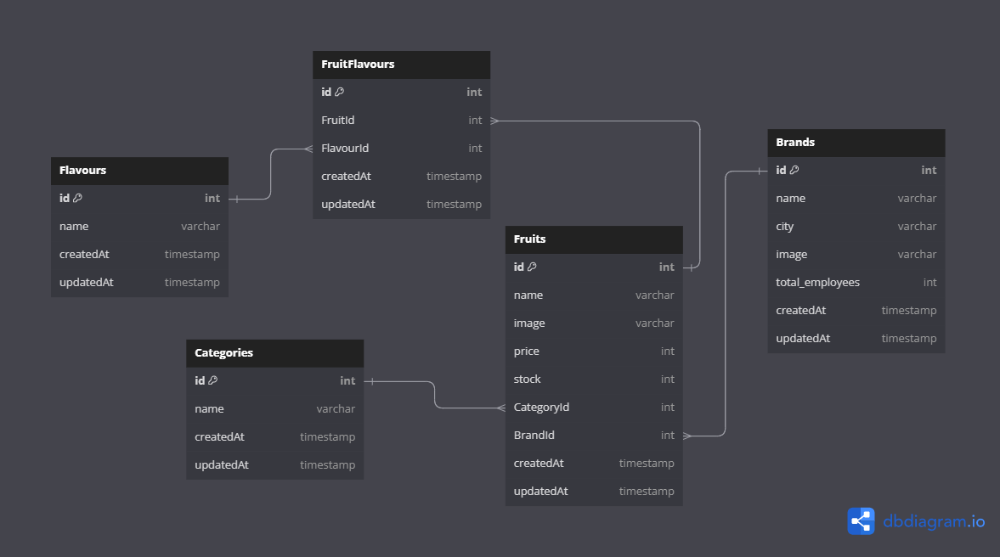

# Database and ERD

## Tasks

A. General Database

1. Jelaskan pengertian dari _**Database**_?
2. Jelaskan singkatan dan pengertian dari _DBMS_?
3. Apa perbedaan _Database_ dan _DBMS_?
4. Apa singkatan dan pengertian dari **SQL**?
5. Sebutkan 5 jenis DBMS menggunakan **SQL** yang anda ketahui?
6. Sebutkan 2 jenis database jika di kategorikan berdasarkan Relasi?
7. Sebutkan 3 jenis perbedaan dari **SQL** dan **NoSQL**?
8. Jelaskan yang di maksud dengan _Query_?
9. Jelaskan singkatan dan pengertian dari **DDL**?
10. Jelaskan singkatan dan pengertian dari **DML**?
11. Sebutkan perintah2 (command) dari **DML**?
12. Sebutkan perintah2 (command) dari **DDL**?

B. ERD

1. Jelaskan pengertian dari ERD?
2. Sebutkan relasi yang ada dalam ERD?
3. Apa yg dimaksud dengan relasi _One To One_?
4. Dalam relasi _Many To Many_ ada table tambahan, sebutkan nama table tambahan tersebut?
5. Apa arti dari _Primary Key_?
6. Apa arti dari _Foreign Key_?
7. Mengapa table memiliki relasi?

C. Study Case

1. Gambar Table

   

   - Buatlah 2 table menggunakan DB Diagram. (gambar hanya contoh)

2. Gambar ERD

   

   - Buatlah ERD menggunakan min 3 table dan relasi One To Many. (gambar hanya contoh)
